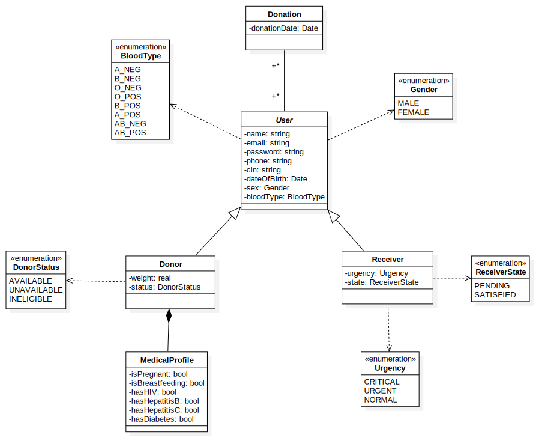

# tal3dem — Blood Bank Management System (JEE)

Project overview:

- Manage blood donors and receivers with full CRUD, validation, and matching.
- Business rules: compatibility matrix (O- universal donor, AB+ universal receiver), donor eligibility (age, weight, medical), receiver priority (CRITICAL > URGENT > NORMAL).
- Automatic states: donor availability; receiver status (PENDING → SATISFIED) based on required bags.

## Features

- Donor/Receiver CRUD with validations (age, weight, medical contraindications)
- Matching by blood compatibility and priority (CRITICAL > URGENT > NORMAL)
- 1 bag per donation; receiver state auto-updates (PENDING → SATISFIED)
- Receivers list sorted by priority; optional filters/search
- Logging via SLF4J + Logback

## Tech stack

- Java 17, Maven (WAR)
- Jakarta Servlet 6, JSP/JSTL
- JPA/Hibernate 6
- PostgreSQL
- Tomcat 10.1+
- Tests: JUnit 4, Mockito

## Prerequisites

- JDK 17+
- Maven 3.9+
- Tomcat 10.1+ (Jakarta EE 10)
- PostgreSQL 13+ running locally

## Quick start

1. Clone

```bash
git clone https://github.com/tahajaiti/tal3dem.git
cd tal3dem
```

2. Database (PostgreSQL)

```bash
psql -U postgres -c "CREATE DATABASE tal3dem;"
psql -U postgres -c "CREATE USER tal3dem WITH PASSWORD 'tal3dem';"
psql -U postgres -c "GRANT ALL PRIVILEGES ON DATABASE tal3dem TO tal3dem;"
```

## JPA configuration (already set up)

- persistence.xml is already present and reads DB settings from environment:
  - DB_URL, DB_USER, DB_PASS
- No manual XML changes needed unless you change property names.

## Build (Maven)

```bash
mvn clean package -DskipTests
```

WAR output: target/ROOT.war

4. Deploy on Tomcat 10.1+

- Copy target/ROOT.war to $CATALINA_BASE/webapps/
- Start Tomcat:
  - Linux/macOS: $CATALINA_BASE/bin/catalina.sh run
  - Windows: %CATALINA_BASE%\bin\catalina.bat run
- App URL: http://localhost:8080/
- Check web.xml for exact routes (e.g., /create, /donors, /receivers)

## Tests

- Frameworks: JUnit 4 + Mockito.
- Location: src/test/java
- Run locally:

```bash
mvn test
# single test
mvn -Dtest=YourTestClass test
```

## Project structure

```
tal3dem/
├─ src/
│  ├─ main/
│  │  ├─ java/
│  │  │  ├─ org/kyojin/tal3dem/web/        # Servlets (controllers)
│  │  │  ├─ org/kyojin/tal3dem/service/    # Services (business rules, matching)
│  │  │  ├─ org/kyojin/tal3dem/repository/ # Repository (JPA)
│  │  │  └─ org/kyojin/tal3dem/model/      # JPA entities
│  │  ├─ resources/
│  │  │  └─ META-INF/persistence.xml
│  │  └─ webapp/
│  │     ├─ WEB-INF/
│  │     │  ├─ web.xml
│  │     │  └─ views/                      # JSPs (JSTL: <%@ taglib prefix="c" uri="http://jakarta.ee/jstl/core" %>)
│  │     └─ assets/                        # CSS/JS/images
│  └─ test/java/                           # unit tests (JUnit 4)
├─ pom.xml
└─ README.md
```

## Run with Docker Compose (no local Tomcat)

Use the provided docker-compose.yml. It starts PostgreSQL and Tomcat, mounts the exploded WAR from target/ROOT, and passes DB config via env.

1. Create .env in the project root:

```
POSTGRES_USER=postgres
POSTGRES_PASSWORD=root
POSTGRES_DB=tal3dem

DB_URL=jdbc:postgresql://db:5432/tal3dem
DB_USER=postgres
DB_PASS=root
```

2. Build the WAR (generates target/ROOT and ROOT.war):

```bash
mvn clean package
```

3. Start services:

```bash
docker compose up -d
```

- App URL: http://localhost:8080/
- PostgreSQL: localhost:5432 (uses credentials from .env)

4. Stop/clean:

```bash
docker compose down
```

Notes:

- persistence.xml uses DB_URL, DB_USER, DB_PASS from env. Compose also mounts .env into the webapp if your code reads it via dotenv.
- If you change code, rebuild with mvn package and restart the tomcat service.

## UML Class Diagram

```

```